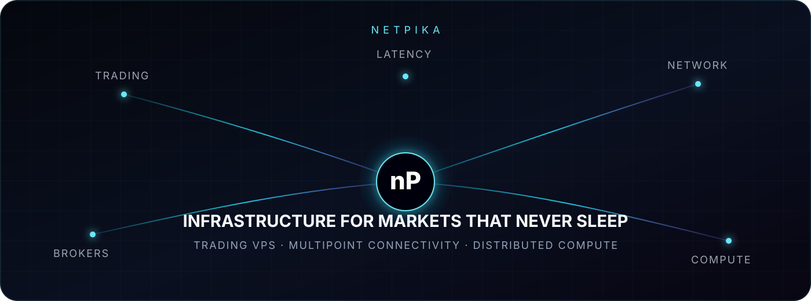

 

# High-performance infrastructure for trading

**Forex VPS · Quant Computing · Network Intelligence · Mining Automation**

[**Explore Forex VPS**](https://netpika.com/vps-bot-trading) · [**Test your latency**](https://looking.netpika.com) · [**Quant Trading**](https://netpika.com/vps-quant-trading) · [**Network status**](https://netpika.com/serverstatus.php)

---

## Built for markets that never sleep

netPika designs high-performance server environments for traders who depend on continuous execution, stable connectivity and operational control.

Our infrastructure is built for MetaTrader 4/5, cTrader, NinjaTrader, Expert Advisors, CopyTrading, quantitative research, backtesting and other always-on financial workloads. High-frequency DDR5 memory, fast storage, modern compute and carefully engineered network paths provide the foundation; netPika's management and support layer turns that foundation into a service made specifically for trading.

> netPika provides computing infrastructure. We are not a broker, do not manage customer funds and do not provide financial advice or guaranteed trading results.

## One platform. Four connected capabilities.

| | Capability | What it delivers | Status |
|:--:|---|---|:--:|
| **01** | **Forex VPS** | Windows environments optimized for EAs, trading terminals and CopyTrading, available continuously without relying on a home computer or connection. | **LIVE** |
| **02** | **Quant Trading** | Scalable DDR5 compute for StrategyQuant X, backtesting, Walk-Forward analysis, Monte Carlo simulations and sustained research workloads. | **LIVE** |
| **03** | **netPika MultiPoint Connection** | Real-time connectivity diagnostics from netPika infrastructure toward brokers, servers and public destinations. | **LIVE** |
| **04** | **netPika Mining** | CPU mining orchestration with remote control, automation, resource limits and dynamically selected strategies. | **IN DEVELOPMENT** |

## netPika MultiPoint Connection

Latency is not a marketing number. It is the result of distance, routing, network load, the destination's infrastructure and the quality of every path in between.

The **netPika MultiPoint Connection** gives traders a direct way to test connectivity toward a broker IP or domain before choosing an environment. It transforms infrastructure selection into something measurable: enter a destination, run the diagnostic and inspect the route from netPika's connectivity platform.

### Your broker. Your destination. A real network test.

[**Launch the Latency Test →**](https://looking.netpika.com)

## Designed for trading workloads

- **DDR5 infrastructure** for greater memory bandwidth and operational headroom.
- **Modern high-performance compute** across selected AMD EPYC, AMD Ryzen 9 and Intel Core i9 platforms, according to capacity and service class.
- **Fast storage** for terminals, historical datasets and continuously running processes.
- **Windows-ready environments** for the platforms traders already use.
- **Instant management tools** for access, control and supported system restoration.
- **Proactive infrastructure monitoring** focused on nodes, network availability and operational signals.
- **Spanish-language support** for traders across Latin America.

Actual performance and latency depend on the selected service, assigned hardware, software workload, destination, BGP route and network conditions.

## Products

### Forex VPS

Three service classes designed around real trading workloads—from a single trading terminal to multiple concurrent platforms—with Windows Server, DDR5 memory and continuous operation.

[Compare Forex VPS plans](https://netpika.com/vps-bot-trading)

### Quant Trading

Compute capacity for StrategyQuant X, optimizers, extensive historical datasets, Python/R workflows and research processes that exceed a conventional VPS profile.

[Explore Quant Trading infrastructure](https://netpika.com/vps-quant-trading)

### Network Intelligence

Public tools for testing latency and routes, plus operational visibility into the netPika service platform.

[Test latency](https://looking.netpika.com) · [View network status](https://netpika.com/serverstatus.php)

### netPika Mining

A new control plane for Linux CPU miners: secure agent enrollment, manual or scheduled execution, CPU limits, time-boxed sessions and automatic strategy selection. The platform is under active development; its controller and operational infrastructure remain private by design.

**Status: In development.** Public access will be announced when the client and agent experience is ready.

---

<strong>Español — Ver la presentación completa</strong>

 

## Infraestructura de alto rendimiento para Trading

**VPS Forex · Cómputo Quant · Inteligencia de Red · Automatización de Mining**

[**Explorar VPS Forex**](https://netpika.com/vps-bot-trading) · [**Probar mi latencia**](https://looking.netpika.com) · [**Quant Trading**](https://netpika.com/vps-quant-trading) · [**Estado de la red**](https://netpika.com/serverstatus.php)

## Creada para mercados que nunca duermen

netPika diseña entornos de servidores de alto rendimiento para Traders que dependen de ejecución continua, conectividad estable y control operativo.

Nuestra infraestructura está preparada para MetaTrader 4/5, cTrader, NinjaTrader, Expert Advisors, CopyTrading, investigación cuantitativa, backtesting y otras cargas financieras que deben permanecer activas. Memoria DDR5 de alta frecuencia, almacenamiento veloz, cómputo moderno y rutas cuidadosamente diseñadas forman la base; la capa de administración y soporte de netPika convierte esa base en un servicio creado específicamente para Trading.

> netPika proporciona infraestructura informática. No somos un Broker, no administramos fondos de clientes y no ofrecemos asesoramiento financiero ni resultados de Trading garantizados.

## Una plataforma. Cuatro capacidades conectadas.

| | Capacidad | Qué ofrece | Estado |
|:--:|---|---|:--:|
| **01** | **VPS Forex** | Entornos Windows optimizados para EAs, terminales y CopyTrading, disponibles continuamente sin depender de una computadora o conexión doméstica. | **ACTIVO** |
| **02** | **Quant Trading** | Cómputo DDR5 escalable para StrategyQuant X, backtesting, Walk-Forward, simulaciones Monte Carlo e investigación sostenida. | **ACTIVO** |
| **03** | **Conexión MultiPunto netPika** | Diagnóstico de conectividad en tiempo real desde la infraestructura netPika hacia Brokers, servidores y destinos públicos. | **ACTIVO** |
| **04** | **netPika Mining** | Orquestación de minería CPU con control remoto, automatización, límites de recursos y estrategias seleccionadas dinámicamente. | **EN DESARROLLO** |

## Conexión MultiPunto netPika

La latencia no es un número de marketing. Es el resultado de la distancia, el enrutamiento, la carga de red, la infraestructura del destino y la calidad de cada trayecto intermedio.

La **Conexión MultiPunto netPika** permite que cada Trader pruebe directamente la conectividad hacia la IP o el dominio de su Broker antes de elegir un entorno. La selección de infraestructura se vuelve medible: ingresás el destino, ejecutás el diagnóstico y observás el resultado desde la plataforma de conectividad de netPika.

### Tu Broker. Tu destino. Una prueba real de red.

[**Iniciar el test de latencia →**](https://looking.netpika.com)

## Diseñada para cargas de Trading

- **Infraestructura DDR5** para mayor ancho de banda de memoria y margen operativo.
- **Cómputo moderno de alto rendimiento** sobre plataformas AMD EPYC, AMD Ryzen 9 e Intel Core i9 seleccionadas según capacidad y clase de servicio.
- **Almacenamiento rápido** para terminales, históricos y procesos continuos.
- **Entornos Windows listos** para las plataformas que los Traders ya utilizan.
- **Herramientas de administración inmediata** para acceso, control y restauración compatible del sistema.
- **Monitoreo proactivo de infraestructura** centrado en nodos, disponibilidad de red y señales operativas.
- **Soporte en español** para Traders de toda Latinoamérica.

El rendimiento y la latencia reales dependen del servicio elegido, hardware asignado, carga de software, destino, ruta BGP y condiciones de la red.

## Productos

### VPS Forex

Tres clases de servicio diseñadas alrededor de cargas reales: desde una terminal hasta múltiples plataformas concurrentes, con Windows Server, memoria DDR5 y operación continua.

[Comparar planes VPS Forex](https://netpika.com/vps-bot-trading)

### Quant Trading

Capacidad de cómputo para StrategyQuant X, optimizadores, históricos extensos, flujos Python/R y procesos de investigación que exceden el perfil de un VPS convencional.

[Explorar infraestructura Quant Trading](https://netpika.com/vps-quant-trading)

### Inteligencia de Red

Herramientas públicas para probar latencia y rutas, acompañadas por visibilidad operativa sobre la plataforma de servicios netPika.

[Probar latencia](https://looking.netpika.com) · [Ver estado de la red](https://netpika.com/serverstatus.php)

### netPika Mining

Un nuevo plano de control para mineros CPU Linux: enrolamiento seguro del agente, ejecución manual o programada, límites de CPU, sesiones temporizadas y selección automática de estrategia. La plataforma está en desarrollo activo; su controlador y su infraestructura operativa permanecen privados por diseño.

**Estado: En desarrollo.** El acceso público será anunciado cuando la experiencia del cliente y del agente esté preparada.

---

### netPika

**Trading infrastructure, measured connectivity and intelligent compute.**

[Website](https://netpika.com) · [Latency Test](https://looking.netpika.com) · [Network Status](https://netpika.com/serverstatus.php)

© 2026 netPika. All rights reserved.

